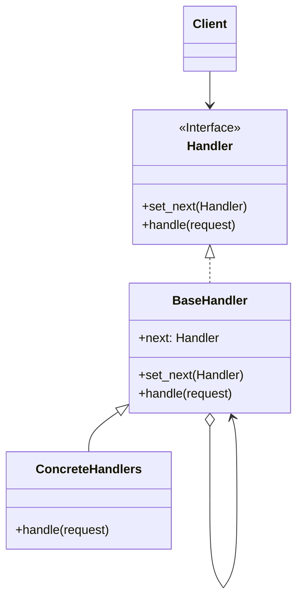
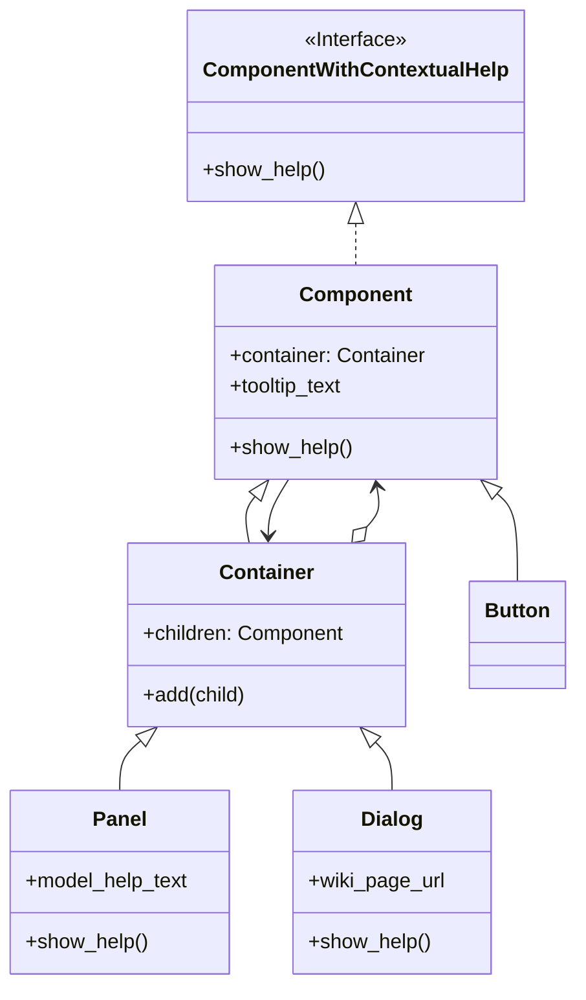

# Chain Of Responsibility/ Chain of Command

[*Behavioural Design Pattern*]

Chain of Responsibility is a behavioural design pattern that
lets you pass request along a chain of handlers. Upon receiving
a request, each handler decides either to process the request
or to pass it to the next handler in the chain.

The above diagram can be interpreted into example below.

In Chain of Responsibility, the responsibility is serially
transferred to next component. Here in this example, a Panel
have multiple dialogs. In a dialog, there are multiple buttons.
If some button do not have help text, then the respective parent
component (Dialog) help is shown. If the Dialog also do not have
help text, the Panel is given the responsibility. In this chain,
if any one of the component can perform the action. The response
returns from there.