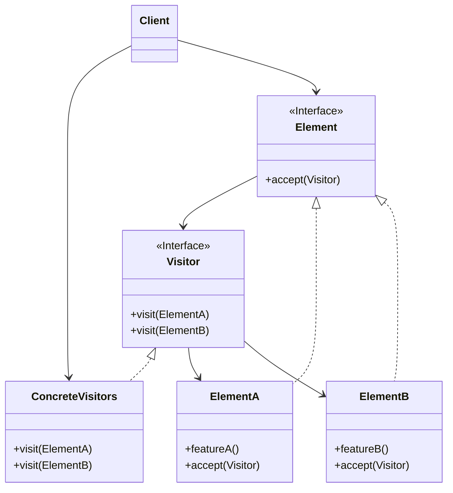
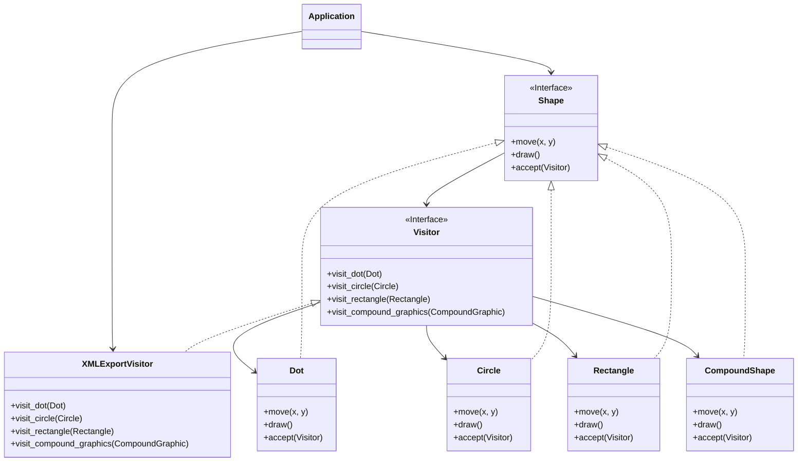

# Visitor

[*Behavioural Design Pattern*]

Visitor is a behavioural design pattern that lets you seperate
algorithms from the objects on which they operate.

The above diagram can be interpreted into example below.

