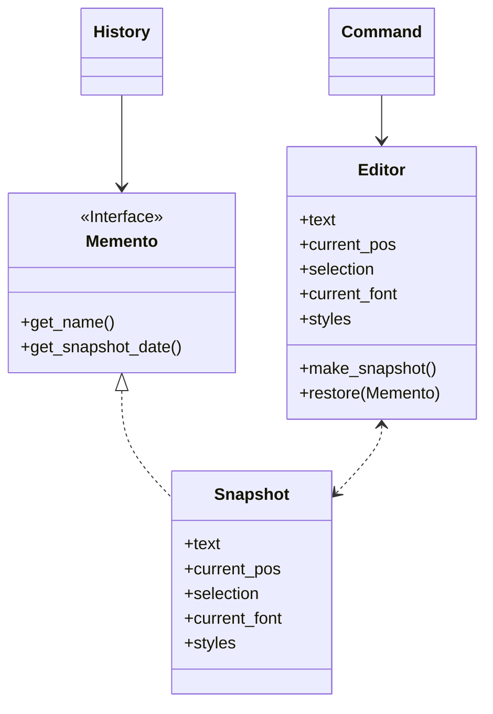
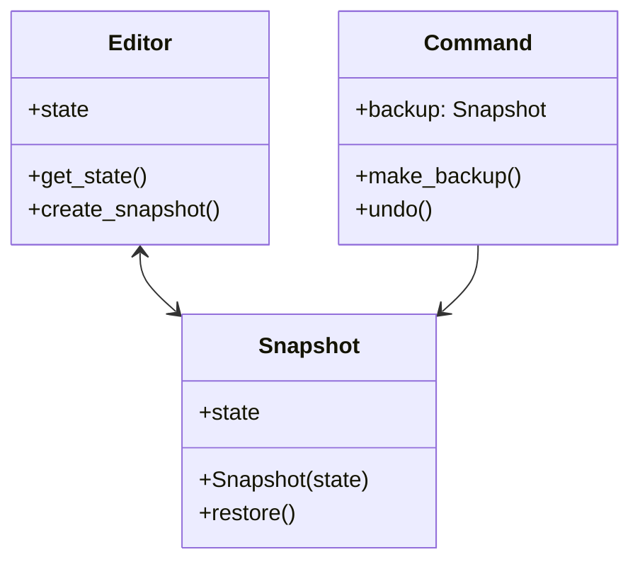

# Memento / Snapshot

[*Behavioural Design Pattern*]

Memento is a behavioural design pattern that lets you save and
restore the previous state of an object without revealing the
details of its implementation.

The above diagram can be interpreted into example below.

Memento pattern is useful when you want to produce snapshot
of object's state to be able to restore a previous state
of the object.
