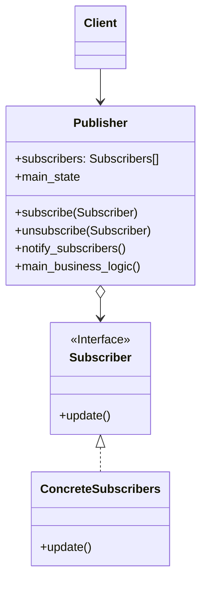
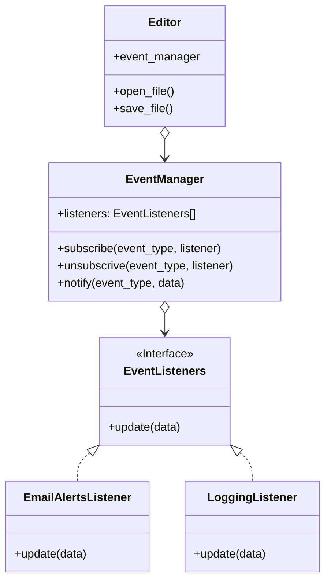

# Observer / Event-Subscriber / Listener

[*Behavioural Design Pattern*]

Observer is a behavioural design pattern that lets you define a
subscription mechanism to notify multiple objects without any
events that happen to the object they're observing.

The above diagram can be interpreted into example below.

Observer pattern is one of my favourite design patterns.
This pattern can be used from small to large projects.
Reactions that are dependent on action on another domain
can be added as listeners to particular event. Whenever that
particular event occurs, the event_manager will trigger all
the listeners. This works by pushing (triggering) the listener
to perform reaction.