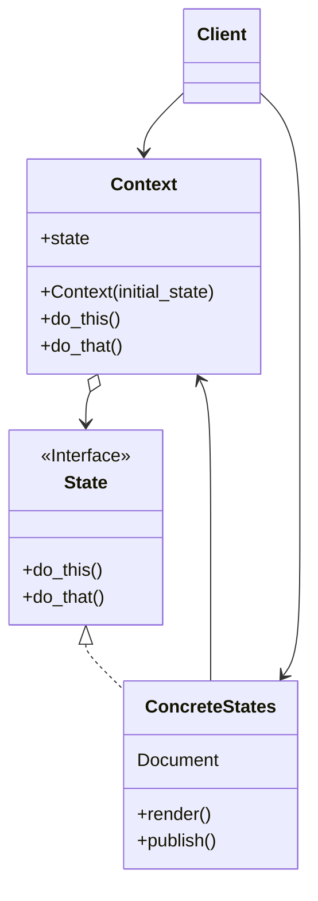
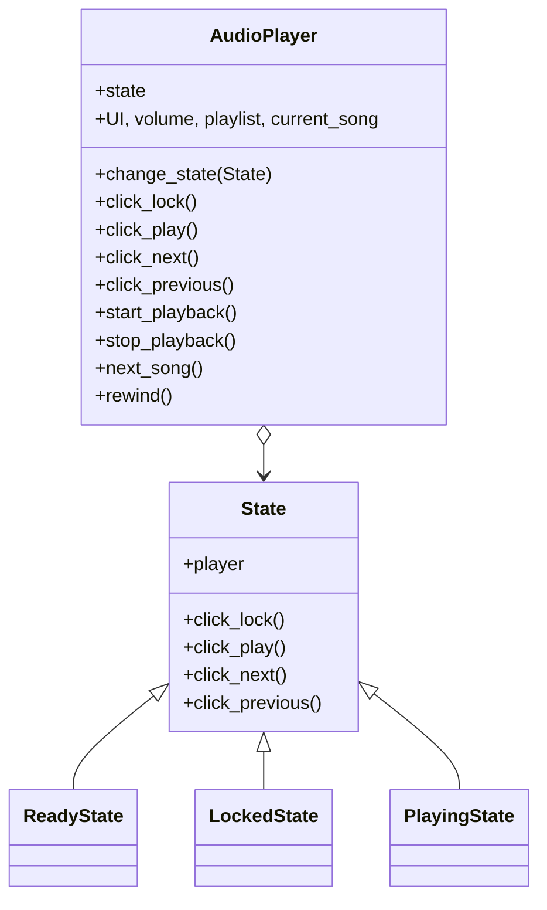

# State

[*Behavioural Design Pattern*]

State is a behavioural design pattern that lets an object alter
its behaviour when its internal state changes. It appears as
if the object changed its class.

The above diagram can be interpreted into example below.

In State pattern, the overall behaviour of object changes
as the state changes. The action of the objects depend directly
on the state of the object. The state does know about other states
and can transfer the state of Context from one to another.