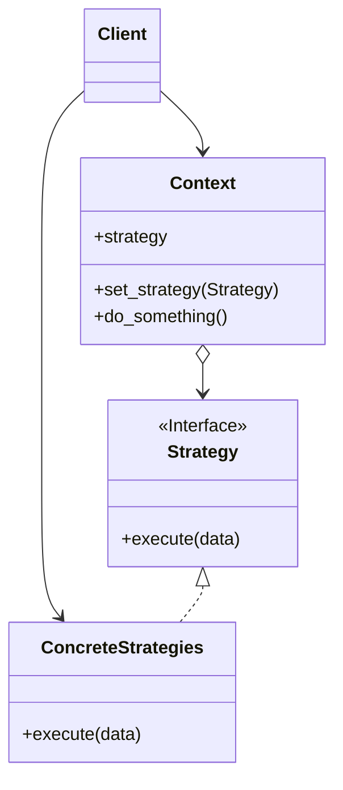

# Strategy

[*Behavioural Design Pattern*]

Strategy is the behavioural design pattern that lets you define
a family of algorithms, put each of them into seperate class,
and make their objects interchangeable.

Strategy pattern is similar to that of State but one strategy
does not know about another strategy.