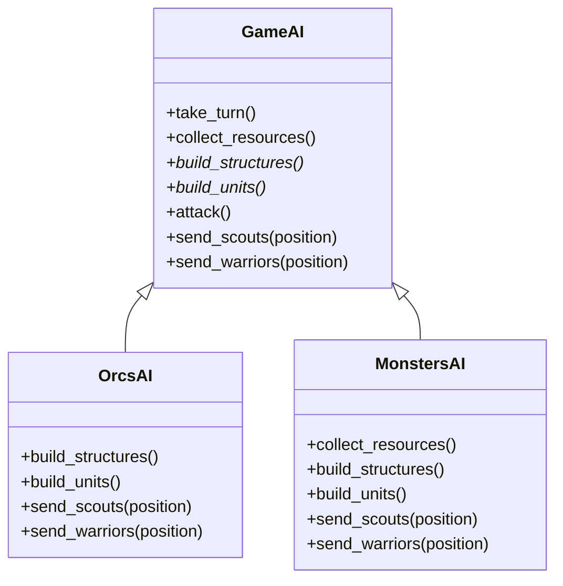

# Template Method

[*Behavioural Design Pattern*]

Template Method is a behavioural design pattern that defines
the skeleton of an algorithm in the superclass but lets
subclasses override specific steps of the algorithm without
changing its structure.


```mermaid
classDiagram
    class AbstractClass
    AbstractClass: +template_method()
    AbstractClass: +step1()
    AbstractClass: +step2()
    AbstractClass: +step3()

    class ConcreteClass1
    ConcreteClass1: +step3()

    class ConcreteClass2
    ConcreteClass2: +step1()
    ConcreteClass2: +step2()
    ConcreteClass2: +step3)

    AbstractClass <|-- ConcreteClass1
    AbstractClass <|-- ConcreteClass2
```

The above diagram can be interpreted into example below.



Inheritance is the base for template method.