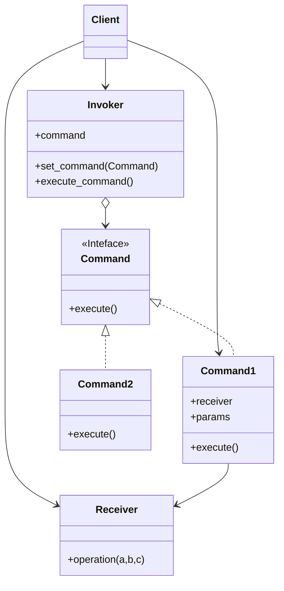
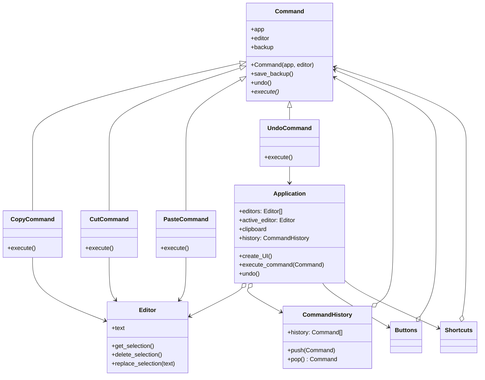

# Command / Action / Transaction

[*Behavioural Design Pattern*]

Command is a behavioural design pattern that turns a request
into a stand-alone object that contains all information about
the request. This transformation lets you parameterize
methods with different requests, dleay or quere an request's
execution, and support undoable operations.

The above diagram can be interpreted into example below.

Command Pattern is useful for queueing operations, scheduling
their executeion or execute them remotely. They also provides
reversible operations.