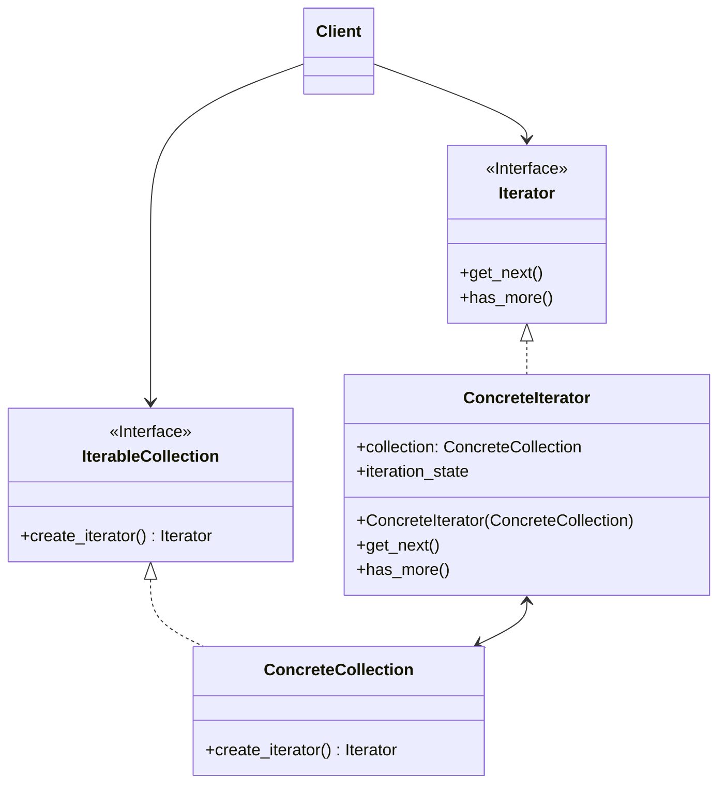
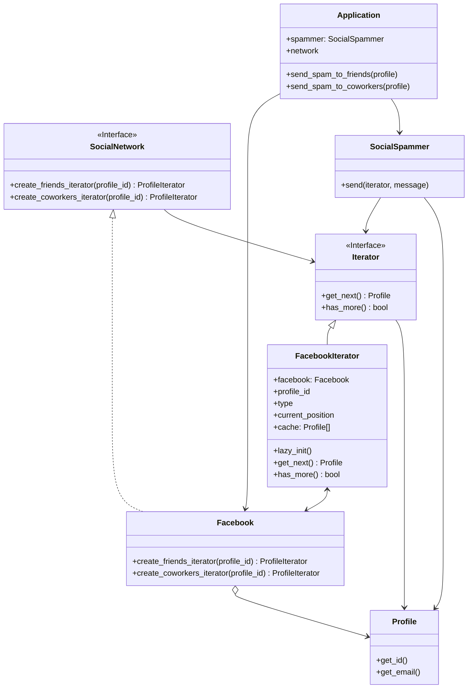

# Iterator

[*Behavioural Design Pattern*]

Iterator is a behavioural design pattern that lets you traverse
elements of a collection without exposing its underlying
representation (list, stack, tree, etc)
Python List, Tuples are perfect example for this

The above diagram can be interpreted into example below.

Iterator pattern provides a medium to iterator over bunch of
objects in a ordered fashion. Here we've used an example of
mass scammer that sends email to all friends or coworkers
at once. Here we created Iterator for all those categories.
In future, we can also add other Social Media Platform like
LinkedIn, etc.
