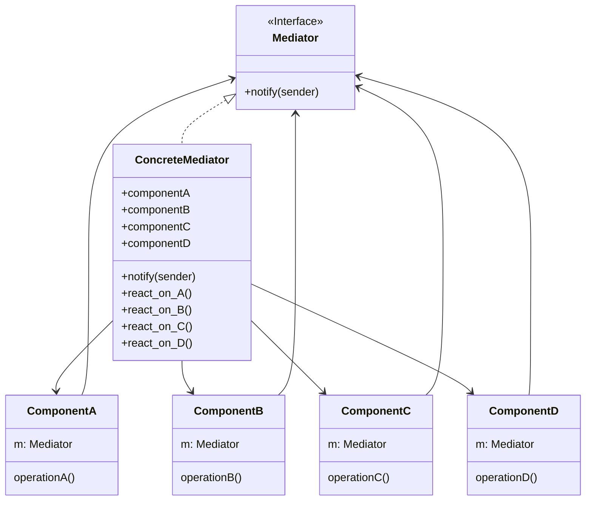
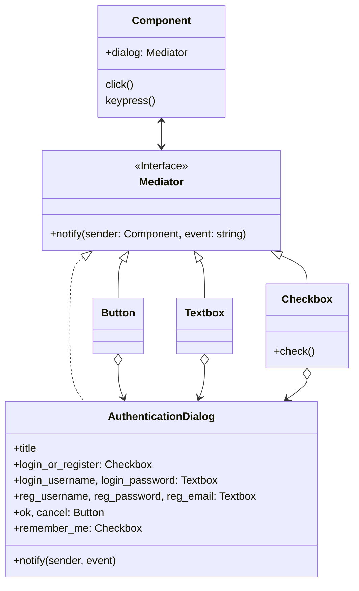

# Mediator / Intermediary / Controller

[*Behavioural Design Pattern*]

Mediator is a behavioural design pattern that lets you reduce
chaotic dependencides between objects. The pattern restricts
direct communications between the objects and forces them to
collaborate only via a mediator object.

The above diagram can be interpreted into example below.

In Mediator pattern, all the action of component is handled by
the mediator object. Here AuthenticationDialog contains all the
components and acts as mediator. A change in any of its component
will trigger notify in the mediator object.