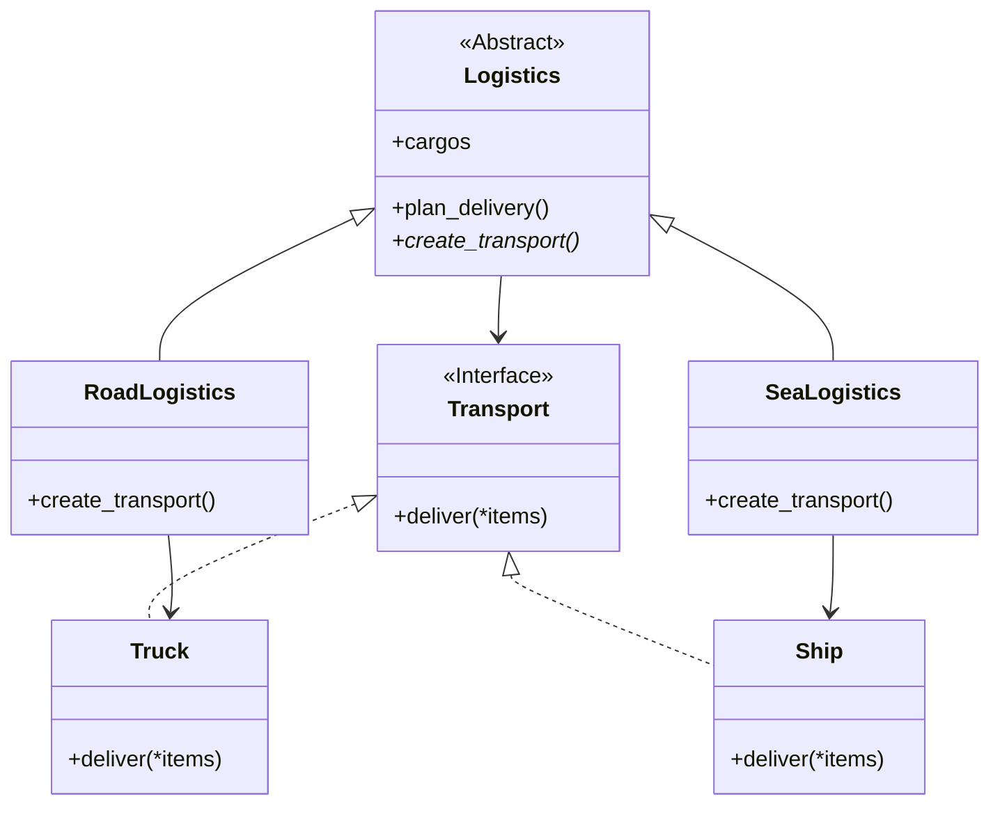

# Factory Method
[*Creational Design Pattern*]

Factory method patterns suggest that you replace direct object
construction calls with calls to a special factory method.

In Factory Method Creational Pattern, the creation of Transport
object is deligated to another class i.e. Logistics class.
The overall logic for delivery in implemented on deliver method
and the correct Transport is created by respective creation factory.