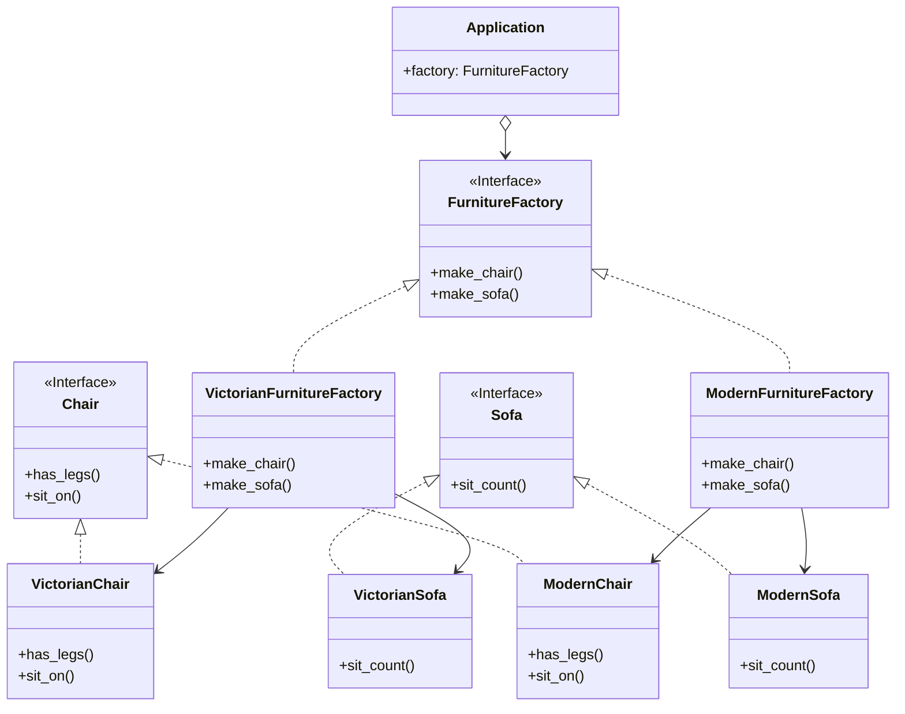

# Abstract Factory

[*Creational Design Pattern*]

Abstract Factory is a creational design pattern that lets you
produce families of related objects without specifying
their concrete classes.

This pattern is similar to that of Factory Creation Pattern,
but the factory here encompasses all the similarly grouped classes.
So for example if a client chooses victorian set, it'll only get
victorian chair and sofa for the entire phase. Similar example can
be observed for GUI design between Windows OS and Linux. As for a
specific OS, the buttons, panels, textbox, etc must of one of the
groups.