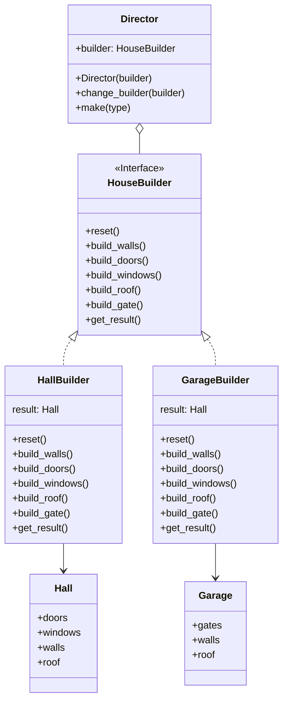

# Builder

[*Creational Design Pattern*]

Builder is a creational design pattern that lets you construct
complex objects step by step. Thus, the pattern allows you to
produce different types and representations of an object using
the same construction code.

According to this pattern, the creation of an class is assigned
to a builder class. The builder has different methods according
to which the instance can have different property after it's creation
gets completed. Here HouseBuilder is implemented by
HallBuilder and GarageBuilder. And accordingly build the respective
object of Hall or Garage with its properties.
Additionally, we can have a Director class, that store the base
rules for creating object with specific properties.