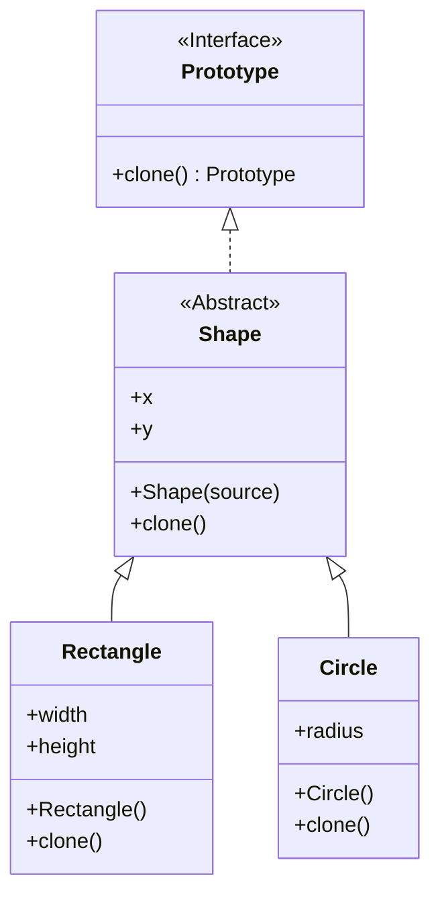

# Prototype

[*Creational Design Pattern*]

Prototype is a creational design pattern that lets you copy
existing objects without making your code dependent on
their classes.

For a large and complicated initialization required for an class,
this pattern can be implemented. This will simplify the creation
as it creates object by cloning and existing object. The required
class implements the Prototype class that implements the clone
method.