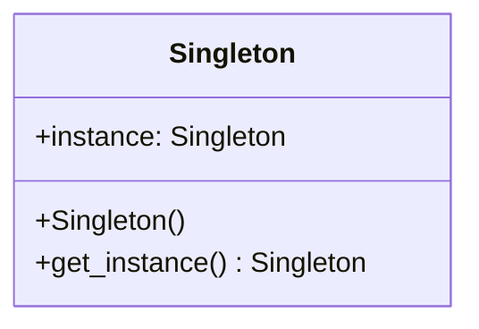

# Singleton

[*Creational Design Pattern*]

Singleton is a creational design pattern that lets you ensure
that a class has only one instance, while providing a global
access point to this instance.

In this approach, when the class is instantiated for first time,
the initializer method is called and all the necessary parameters
are initialized. Later on, whenever the application reinstantiate
the class, the same object is returned to the context.