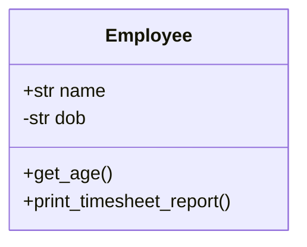
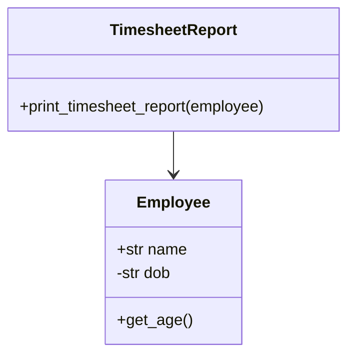

# Single Responsibility Principle

### Before

Instead of keeping everything inside one class.
Employee class must only be responsible for storing/processing 
employee related data, rather than timesheet of employee.

### After

Here responsibility is seperated to another TimesheetReport class.
So Employee class is only responsible for storing employee data but not
processing employee data

