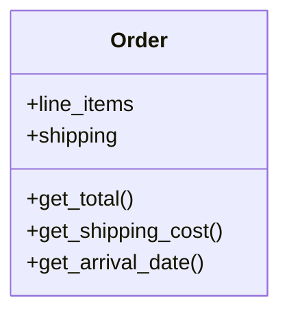
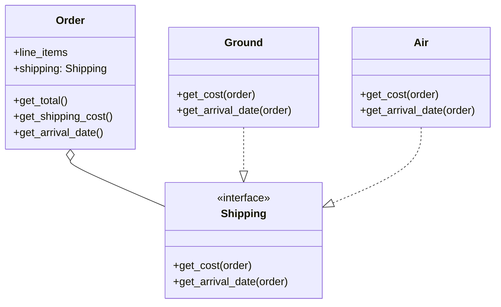

# Open/Closed Principle

# Before

An class should be open for extension but closed for modification.
This is the motto of this principle. Here as we can see, if we need 
to add another shipping method in future let's say by 'waterways',
we need to update the Order class which is not a good way.

# After

Now here, shipping actually is an object that has all the
necessary functions defined using an interface (protocol).
If new shipping method are further added to the system, we now need
no modification in order class. Instead we implement Shipping interface
for our new 'waterways' shipping method