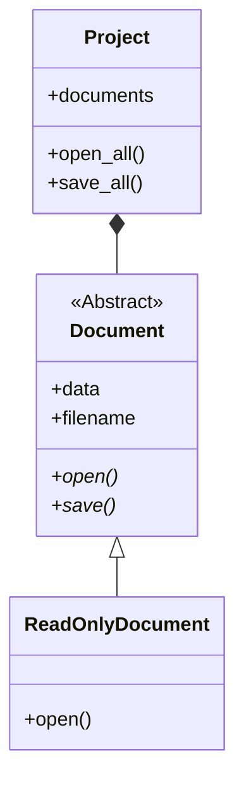
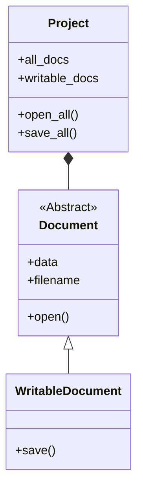

# Liskov Substitution Principle

### Before

In the design, we can see that ReadOnlyDocument inherit from Document.
But ReadOnlyDocument does not implements save method, as ReadOnlyDocument
as the name suggests only reads the document. This will create issue in our
application as ReadOnlyDocument does not implment all the base classes.
One another thing is that the statistical analysis tool will pass ReadOnlyDocument
call save method as we define typing for all document as Document.

### After

Now in this new approach, the base class Document only defines methods
that will be common to all the child class for that system. i.e. all types
of document either be writable, read-only, etc. must/will have open method.
