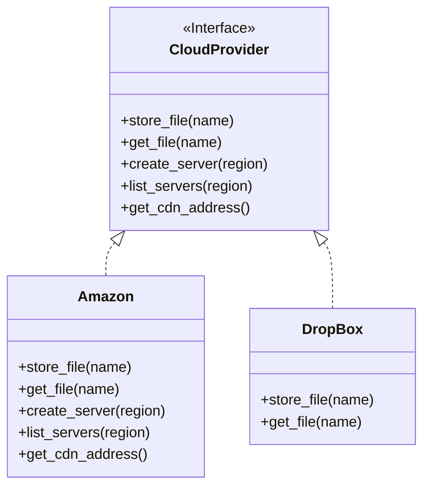
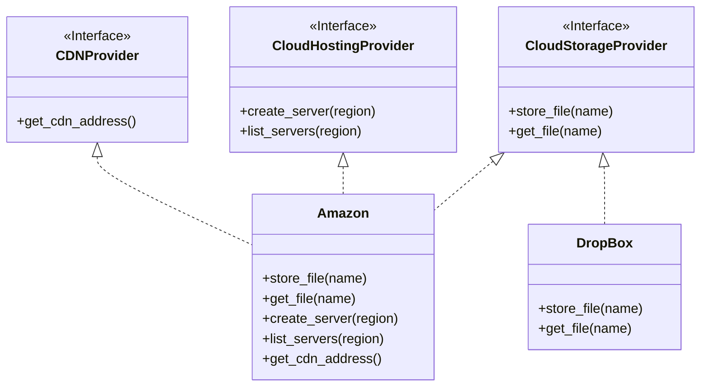

# Inteface Segregation Principle

### Before

When this system was designed, maybe the system only required CloudProvider
to provide services to store and retrive files. So client designed a interface
with store and get method and implemented Amazon and Dropbox.
As program gets larger and added with functionality, it was realized that
we may now need to create servers and use CDN too. But dropbox didn't provided these
services. And theoritically storing data and creating server are two different
domain things. This will eventually create bug in code.

### After

This principle focuses on segregation of interface so that
a class only implements certain inteface to its full. Since DropBox
now does not implement CloudHostingProvider or CDNProvider we now
cannot pass DropBox instance to functions that use these object to create
server or get CDN.