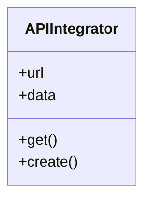
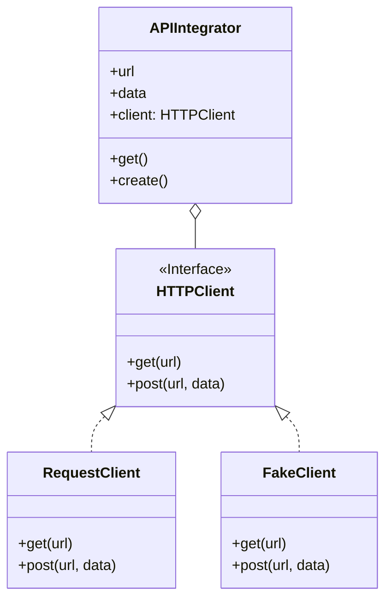

# Dependency Inversion Principle

High-level classes shouldn't depend on low-level classes.
Both should depend on abstractions. Abstractions shouldn't
depend on details. Details should depend on abstractions.

### Before

Instead of APIIntegrator depend on request library, here the dependency
is inversed. APIIntegrator now depend on HTTPClient which is an abstraction
over request library. Now in future, if we need to change the low-level
class like requests, we just need to change the client in APIIntegrator.
Besides it also support for unit testing APIIntegrator module as for test
we can provide fake client.

### After

