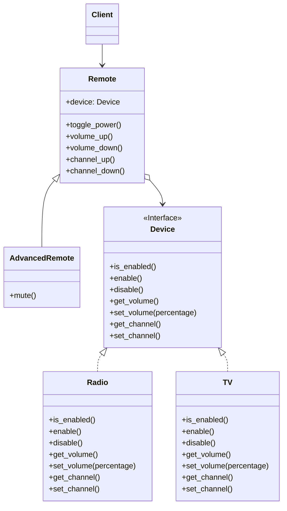

# Bridge

[*Structural Design Pattern*]

Bridge is a structural design pattern that lets you split a large
class or a set of closely related classes into two seperate
hierarchies - abstraction and implementation - which can be
developed independently of each other.

This pattern seems similar to that of adapter pattern. 
It varies as the pattern works on large number of closely
related classes. In this given example, Radio and TV are
closely related classes.
