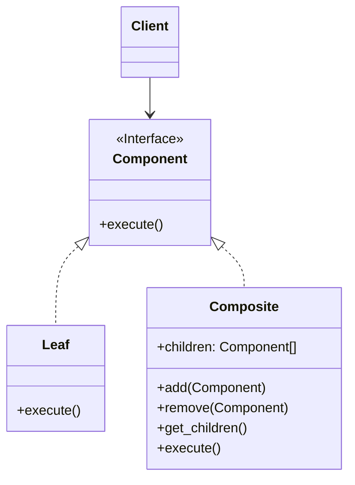
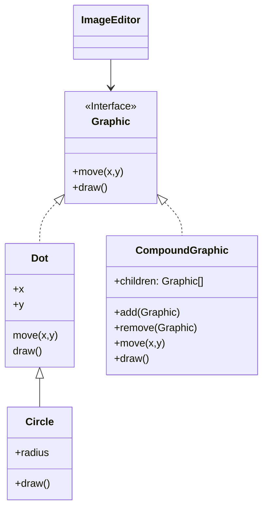

# Composite

[*Structural Design Pattern*]

Composite is a structural design pattern that lets you compose
objects into tree structures and then work with these
structures as if they were individual objects

The above diagram can be interpreted into example below.

Here, using composition we can create complex data structure
by nesting data one inside another. Here the compound graphic
can be formed by composition of zero or many Graphic content