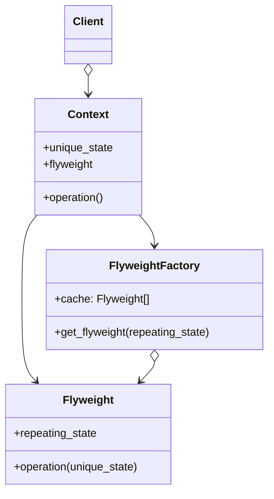
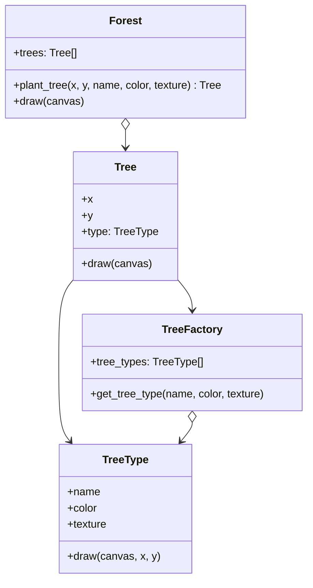

# Flyweight

[*Structural Design Pattern*]

Flyweight is a structural design pattern that lets you fit more
objects into the available amount of RAM by sharing common
parts of state between multiple objects instead of keeping all
of the data in each objects.

The above diagram can be interpreted into example below.

Using this Flyweight pattern, the common attributes are reused
by the system. Those attributes whose value does not change
once initialized can be used as flyweight and reused in another
objects. Here TreeType is a flyweight as the name, color and texture
of a particular tree is same and do not need to be stored in multiple
RAM location.
