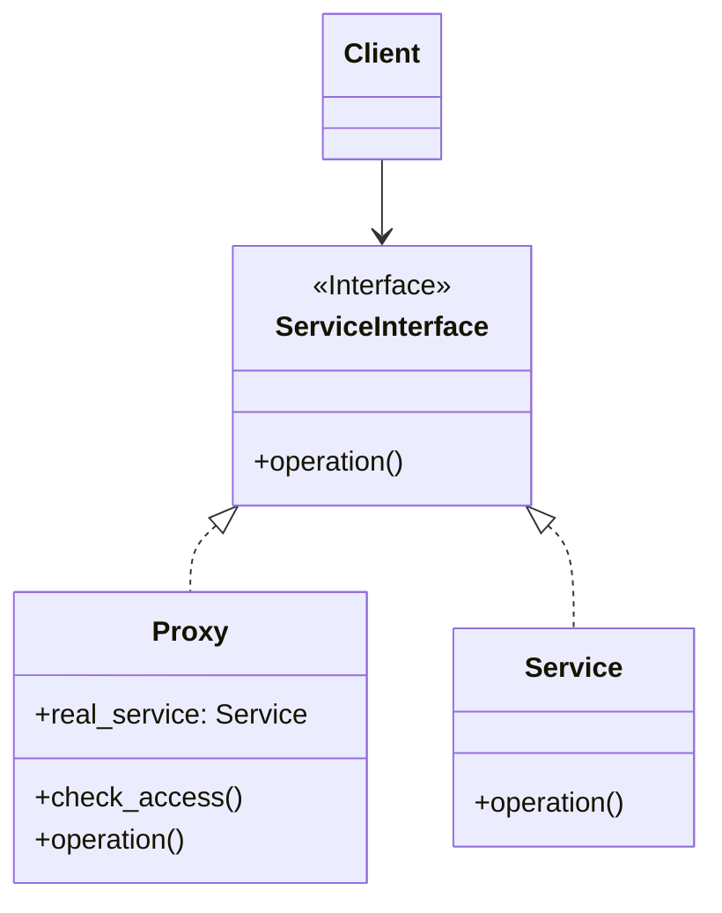
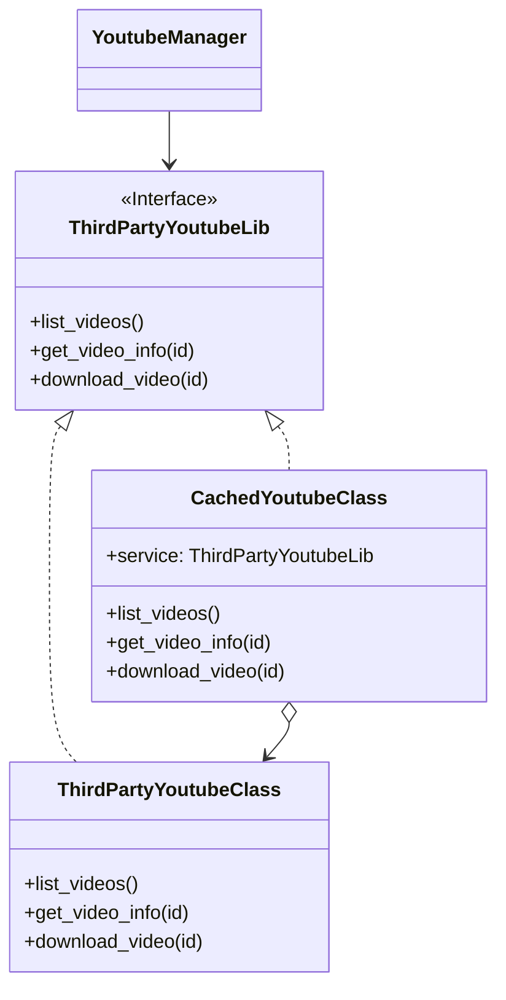

# Proxy

[*Structural Design Pattern*]

Proxy is a structural design pattern that lets you provide a
substitute or placeholder for another object. A proxy controls
access to the original object, allowing you to perform 
something else before or after the request gets through to
the original object.

The above diagram can be interpreted into example below.

In Proxy pattern, the actual service is overwrapped by proxy
object. The proxy object then decides whether to process on its own
or use the actual object to process.