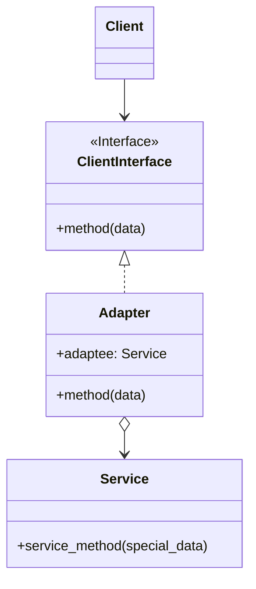
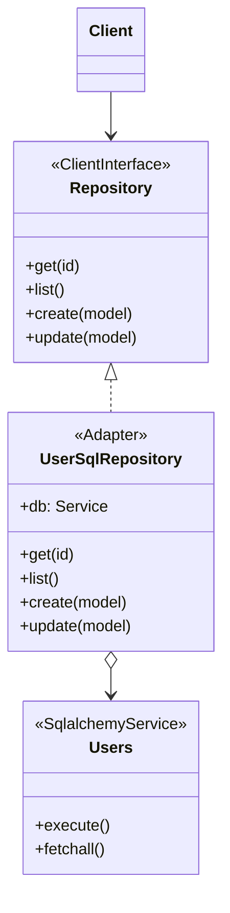

# Adapter

[*Structural Design Pattern*]

Adapter is a structural design pattern that allows
objects with incompatible interfaces to collaborate.

Similar structure can be achieved as below

In this structural pattern, the client depends on an interface
for a third party service. In this given example of SqlAlchemy,
the users is a third party service in which the client is dependent on.
But It will quickly be mess if client calls straight to the
third party service functions. So client actually depend on the
abstraction over an adapter, which infact connect the client to
the actual functions in the service. Thus, the service are now
swappable for client by implementing another adapter.