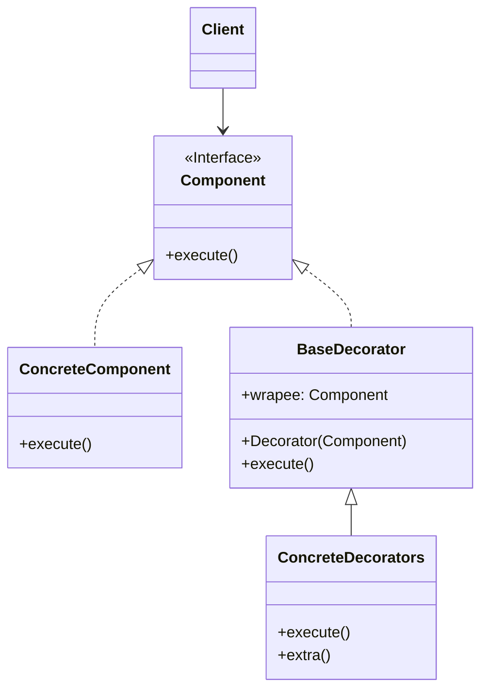
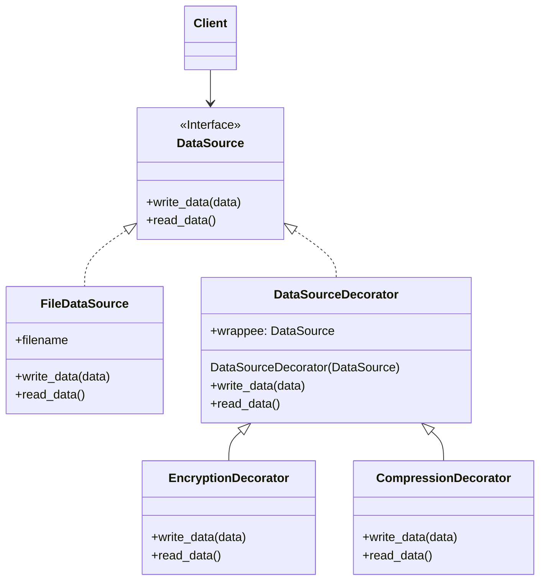

# Decorator/Wrapper

[*Structural Design Pattern*]

Decorator is a structural design pattern that lets you attach
new behaviours to objects by placing these objects inside
special wrapper objects that contain the behaviours.

The above diagram can be interpreted into example below.

In this pattern, the base functionality of the class, i.e.
data read and write is extended by the Decorator classes.
The DataSourceDecorator wraps the FileDataSource and provides
additional functionalities like encryption or compression to
the data.