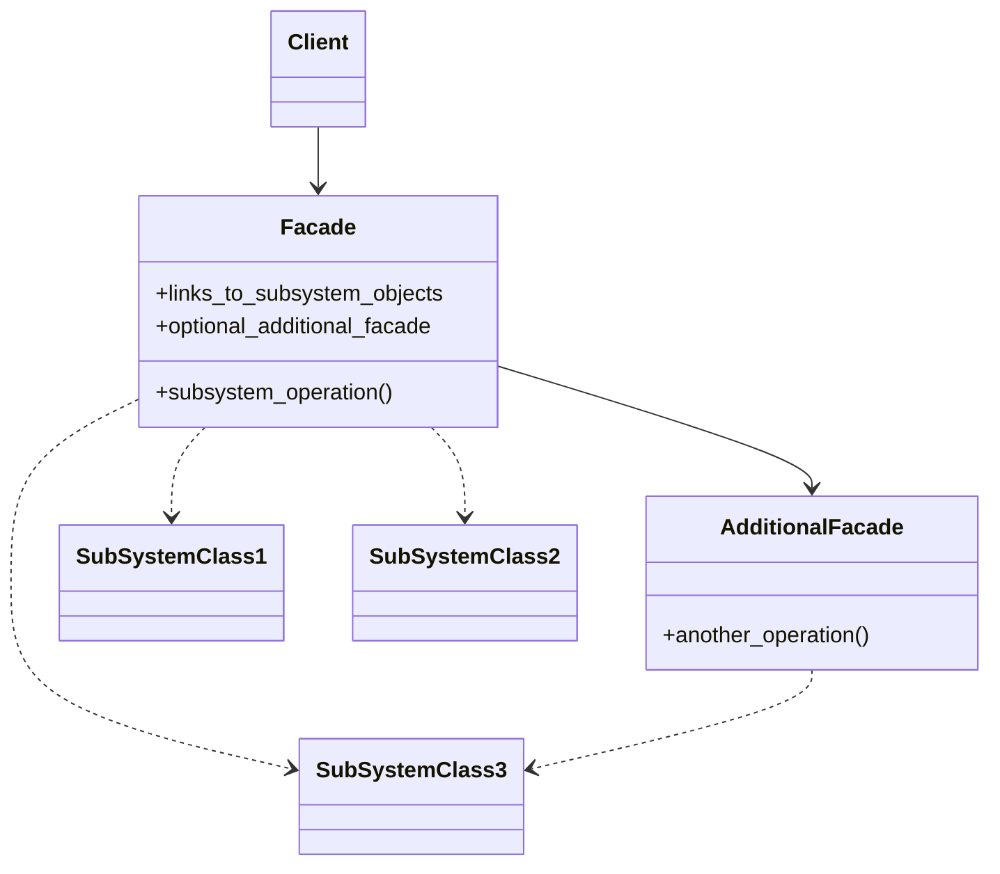
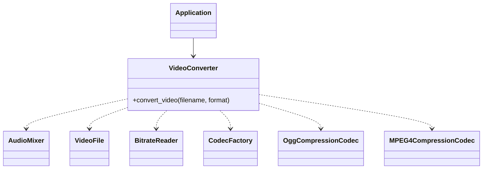

# Facade

[*Structural Design Pattern*]

Facade is a structural design pattern that provides a
simplified interface to a library, a framework, or
any other complex set of classes

The above diagram can be interpreted into example below.

Facade is useful if you need to work with large number of complex
classes. It is useful to work with legacy systems also. Facade works
as an adapter to entire subsytem of objects.
